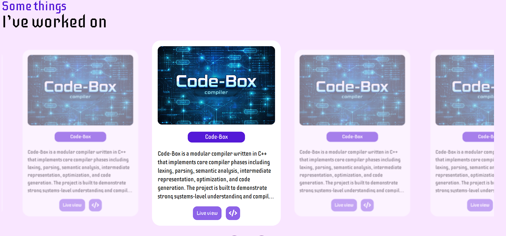

# Sahil Choudhary-Portfolio

A mordern, responsive developer portfolio built using the react, Tailwind css and express(backend)

#### Deployment --> 🚧 Live demo coming soon

### 📸 Preview of the layout

## 🛠️ Tech Stack

- **Frontend:** React, Tailwind CSS
- **Backend: Express**
- **Build Tool:** Vite

## ✨ Features

- Smooth scrolling and animations
- Responsive design for all devices
- Modular and reusable components
- Clean and scalable folder structure

## 📂 Folder Structure

Frontend :

src/
├── components/
├── assets/
├── main.jsx
├── index.css
└── App.jsx

Backend :

├── server.js
└──private/profile.png

## 🚀 Getting Started

### 1. Clone the repository

git clone https://github.com/your-username/portfolio.git

### 2. Install dependencies

1.npm install

2.npm install react-icons --save

3.npm install express cors

4.npm install tailwindcss @tailwindcss/vite

### 3. Run the development server

frontend : npm run dev

backend : node server.js

## 🔐 Environment Variables

Create a `.env.local` file in the backend directory and add:

VITE_ACCESS_KEY=your_key_here

⚠️ Do not commit `.env` files to GitHub.

## 🔮 Future Improvements

- Making it responsive
- Adding light and the dark mode
- Add a better loading section
- Integrate backend for contact form
